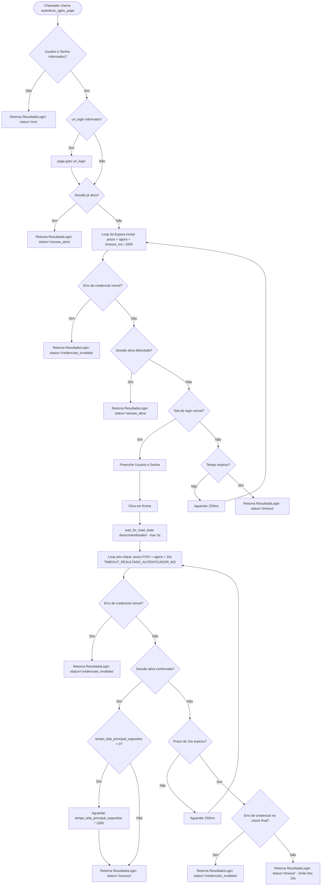

# RFC-005 — Módulo Transversal de Autenticação do AGHUX (autenticador)

- **Status:** Estável
- **Autor:** Ruan
- **Data:** 2026-06
- **Atualizado em:** 2026-06-19
- **Arquivo:** `autenticador.py`
- **Depende de:** `playwright.sync_api`
- **Chamado por:** `PrinterAGHU.py` (RFC-001), `AddPrinterAGHU.py` (RFC-002), `ui_alignprinterAGHU.py` (RFC-003), `criar_usuario_aghu.py`, `ui_criar_usuario_aghu.py`, `criar_pessoa_aghu.py`, `ui_criar_pessoa_aghu.py`, `concessor_aghu.py`, `ui_concessor.py`, `profissionais_unidade_cirurgica_aghu.py`, `ui_profissionais_unidade_cirurgica.py`, `test_ui_autenticador.py`

---

## Mudanças incorporadas nesta revisão

| Data | Mudança | Justificativa |
|---|---|---|
| 2026-06-19 | Formalização do prazo fixo de timeout pós-clique (`TIMEOUT_RESULTADO_AUTENTICADOR_MS = 10000`), documentação da espera pós-sucesso (`tempo_tela_principal_segundos`), inclusão do `SELECTOR_ERRO_AUTENTICACAO` e mapeamento completo dos 12 chamadores reais (núcleos de automação e interfaces gráficas UI). | Garantir rastreabilidade transversal, documentar comportamento real de timeout pós-submissão e detalhar os dois padrões de importação (`AGHU_URL` + funções de login nos núcleos vs. `AGHU_URL` + `AGHU_URL_HOMOLOGACAO` nas UIs). |

---

## 1. Resumo

`autenticador.py` centraliza a autenticação no AGHUX. O módulo concentra URLs, seletores da tela de login, detecção de sessão ativa, detecção de credenciais inválidas e wrappers usados pelos robôs.

O uso principal é `autenticar_aghu_page`, que autentica uma `Page` já existente sem criar ou fechar browser/context/page. Para teste manual ou execução isolada, existe `autenticar_aghu`, que cria e fecha seus próprios recursos do Playwright.

---

## 2. Motivação e Escopo

A autenticação é uma dependência transversal dos fluxos AGHUX. Mantê-la em um único arquivo evita duplicação de seletores, mensagens de erro e critérios de sessão ativa em `PrinterAGHU.py`, `AddPrinterAGHU.py` e telas auxiliares.

O autenticador sabe:

| Responsabilidade | Descrição |
|---|---|
| URLs | Resolve Produção e expõe Homologação |
| Login | Localiza campos, preenche credenciais e clica em **Entrar** |
| Estado | Diferencia sessão ativa, sucesso, credencial inválida, timeout e erro técnico |
| Compatibilidade | Mantém wrappers para chamadas antigas |

O módulo não conhece regras de negócio de impressoras, menu ou planilhas.

---

## 3. Arquitetura e Fluxo de Dados

### Diagrama de Decisão e Fluxo de Execução



Para teste isolado via `autenticar_aghu(...)`:

```text
autenticar_aghu(...)
    ├─ Cria Playwright, browser, context e page
    ├─ Chama autenticar_aghu_page(...)
    └─ Fecha context e browser em bloco try...finally
```

---

## 4. Dependências

Dependências diretas da biblioteca padrão e do ecossistema Python:

- `os`: Leitura de variáveis de ambiente (`AGHU_URL`, `URL_LOGIN_AGHU`, `AGHU_USUARIO`, `AGHU_SENHA`).
- `time`: Controle de tempo monotônico (`time.monotonic()`) para loops de timeout.
- `dataclass`: Definição de estruturas imutáveis de retorno (`ResultadoLogin`).
- `typing`: Anotações de tipo (`Literal`, `Optional`, `Sequence`).

---

## 5. Integração com Playwright

O módulo utiliza explicitamente os seguintes componentes de `playwright.sync_api`:

| Item | Responsabilidade |
|---|---|
| `Page` | Representa a aba/página web do navegador sobre a qual ocorrem as interações. |
| `Error` (como `PlaywrightError`) | Exceção base do Playwright capturada para tratar falhas genéricas de execução ou navegação. |
| `TimeoutError` (como `PlaywrightTimeoutError`) | Exceção capturada quando seletores ou condições aguardadas não ficam visíveis no prazo especificado. |
| `sync_playwright` | Gerenciador de contexto síncrono para inicialização isolada de Browser/Context/Page na função `autenticar_aghu`. |

---

## 6. Constantes e Configurações

URLs públicas:

| Constante | Uso |
|---|---|
| `DEFAULT_AGHU_URL` | URL padrão de Produção (`https://aghu.hub-unb.ebserh/aghu/pages/casca/casca.xhtml`) |
| `AGHU_URL_HOMOLOGACAO` | URL do ambiente de Homologação (`http://10.6.0.152:8080/aghu/pages/casca/casca.xhtml`) |
| `AGHU_URL` | URL efetiva, com override via variáveis de ambiente `AGHU_URL` ou `URL_LOGIN_AGHU` |
| `URL_LOGIN_AGHU` | Alias de compatibilidade legado de `AGHU_URL` |

Seletores, mensagens e timeouts:

| Item | Valor / Padrão | Uso |
|---|---|---|
| `SELECTOR_USUARIO` | `[id="usuario:usuario:inputId"]` | Seletor preferencial do campo de usuário |
| `SELECTOR_SENHA` | `[id="password:inputId"]` | Seletor preferencial do campo de senha |
| `SELECTOR_ENTRAR` | `[id="entrar"]` | Seletor preferencial do botão de submissão |
| `SELETORES_USUARIO_FALLBACK` | Tuple de 6 seletores CSS | Alternativas caso o ID preferencial de usuário não seja localizado |
| `SELETORES_SENHA_FALLBACK` | Tuple de 6 seletores CSS | Alternativas para a localização do campo de senha |
| `SELETORES_ENTRAR_FALLBACK` | Tuple de 6 seletores CSS | Alternativas para o botão de submissão |
| `SELECTOR_ERRO_AUTENTICACAO` | `.ui-messages-info-detail` | Classe CSS container das mensagens de erro do PrimeFaces |
| `MENSAGEM_ERRO_AUTENTICACAO` | *"Erro de autenticação. Favor verificar..."* | Texto exato exibido pelo AGHUX em caso de credenciais inválidas |
| `SELECTOR_TELA_PRINCIPAL_AGHU` | `.usuario-dados .nome-usuario` | Elemento container do nome do usuário autenticado |
| `TEXTO_TELA_PRINCIPAL_AGHU` | `"Olá,"` | Prefixo textual esperado na saudação do usuário logado |
| `TEXTO_MENU_PRINCIPAL_AGHU` | `"Outros Módulos"` | Texto marcador de sessão ativa no menu lateral (fallback) |
| `tempo_tela_principal_segundos` | `3` (segundos) | Tempo de espera/pausa pós-sucesso para renderização/estabilização da tela principal |
| `TIMEOUT_RESULTADO_AUTENTICADOR_MS` | `10000` (10s) | Prazo FIXO de tolerância no loop pós-clique em "Entrar" |

> [!IMPORTANT]
> **Comportamento de Timeout:** O parâmetro `timeout_ms` recebido do chamador (ex.: `15000` ms) é utilizado para a navegação inicial, busca de tela de login e preenchimento de campos. No entanto, após o clique no botão **Entrar**, a confirmação do resultado utiliza o prazo **FIXO** de 10.000 ms (`TIMEOUT_RESULTADO_AUTENTICADOR_MS`), independente do valor de `timeout_ms` informado pelo chamador.

---

## 7. Resultado e API Pública

### 7.1 `ResultadoLogin`

```python
StatusLogin = Literal[
    "sucesso",
    "sessao_ativa",
    "credenciais_invalidas",
    "timeout",
    "erro",
]

@dataclass(frozen=True)
class ResultadoLogin:
    status: StatusLogin
    mensagem: str
    url_final: Optional[str] = None
```

Status esperados:

| Status | Significado |
|---|---|
| `sucesso` | Login efetuado e confirmado na tela principal |
| `sessao_ativa` | A `Page` já possuía uma sessão autenticada válida |
| `credenciais_invalidas` | O AGHUX exibiu erro de usuário/senha inválidos |
| `timeout` | Tela de login ou tela principal não confirmadas no prazo estipulado |
| `erro` | Falha técnica do Playwright ou exceção inesperada |

### 7.2 Funções Públicas

#### `autenticar_aghu_page`

- **Assinatura:** `autenticar_aghu_page(page: Page, usuario: str, senha: str, url_login: str = AGHU_URL, timeout_ms: int = 15000, tempo_tela_principal_segundos: int = 3, selector_tela_principal: str = SELECTOR_TELA_PRINCIPAL_AGHU) -> ResultadoLogin`
- **Descrição:** Função principal de autenticação. Realiza o login utilizando um objeto `Page` pré-existente sem criar ou encerrar conexões/navegadores.
- **Parâmetros e Comportamentos:**
  - `page`: Instância de `Page` do Playwright.
  - `usuario`: Nome de usuário (passa por `.strip()`).
  - `senha`: Senha de acesso (não sofre normalização e não é registrada em logs).
  - `url_login`: URL de destino. Se informada, executa `page.goto(url_login)`.
  - `timeout_ms`: Tempo limite em milissegundos para a fase de navegação e preenchimento (padrão: 15.000 ms).
  - `tempo_tela_principal_segundos`: Pausa de estabilização pós-sucesso (padrão: 3s).
  - `selector_tela_principal`: Seletor para validação da saudação (padrão: `SELECTOR_TELA_PRINCIPAL_AGHU`).

#### `autenticar_aghu`

- **Assinatura:** `autenticar_aghu(usuario: str, senha: str, url_login: str = URL_LOGIN_AGHU, headless: bool = False, timeout_ms: int = 15000, tempo_tela_principal_segundos: int = 3, selector_tela_principal: str = SELECTOR_TELA_PRINCIPAL_AGHU) -> ResultadoLogin`
- **Descrição:** Wrapper para testes isolados e scripts manuais. Instancia a engine do Playwright (`sync_playwright`), cria browser, contexto e página, executa `autenticar_aghu_page` e garante o encerramento dos recursos no bloco `finally`.

#### `exigir_login_valido`

- **Assinatura:** `exigir_login_valido(resultado: ResultadoLogin) -> None`
- **Descrição:** Função utilitária de asserção. Se `resultado.status` for diferente de `"sucesso"` ou `"sessao_ativa"`, levanta uma exceção `RuntimeError` contendo a mensagem de erro do resultado.

#### `fazer_login`

- **Assinatura:** `fazer_login(page: Page, usuario_str: str, senha_str: str, *, timeout_ms: int = 15000) -> ResultadoLogin`
- **Descrição:** Wrapper de compatibilidade legada. Invoca `autenticar_aghu_page` e em seguida `exigir_login_valido`, retornando o resultado caso a autenticação seja bem-sucedida.

---

## 8. Componentes Internos

As funções privadas (iniciadas por `_`) auxiliam na detecção de estado e manipulação dos elementos da página:

| Função | Assinatura | Papel |
|---|---|---|
| `_url_atual` | `_url_atual(page: Page) -> Optional[str]` | Lê a propriedade `page.url` de forma segura, retornando `None` se a página foi fechada ou em caso de erro no Playwright. |
| `_primeiro_visivel` | `_primeiro_visivel(page: Page, seletores: Sequence[str], timeout_ms: int = 1000)` | Itera sobre a lista de seletores fornecida e retorna o primeiro locator que se tornar visível no prazo. Lança `PlaywrightTimeoutError` se nenhum seletor responder. |
| `_erro_autenticacao_visivel` | `_erro_autenticacao_visivel(page: Page, timeout_ms: int = 1000) -> bool` | Verifica a presença da mensagem de erro de credenciais por correspondência exata de texto ou pela classe `SELECTOR_ERRO_AUTENTICACAO`. |
| `_menu_principal_visivel` | `_menu_principal_visivel(page: Page, timeout_ms: int = 1000) -> bool` | Confirma a presença do texto `TEXTO_MENU_PRINCIPAL_AGHU` ("Outros Módulos") visível na página. |
| `_login_efetuado` | `_login_efetuado(page: Page, selector_tela_principal: str = SELECTOR_TELA_PRINCIPAL_AGHU, timeout_ms: int = 1000) -> bool` | Avalia se a sessão está ativa: primeiro verifica ausência de erro, depois valida a saudação `"Olá,"` no seletor da tela principal ou fallback no menu principal. |
| `_tela_login_visivel` | `_tela_login_visivel(page: Page, timeout_ms: int = 1000) -> bool` | Confirma se a tela de login está visível testando os seletores do campo de senha (`SELETORES_SENHA_FALLBACK`). |
| `_preencher_credenciais` | `_preencher_credenciais(page: Page, usuario: str, senha: str, timeout_ms: int) -> None` | Localiza os campos de usuário e senha via `_primeiro_visivel` e executa `.fill()`. |
| `_clicar_entrar` | `_clicar_entrar(page: Page, timeout_ms: int) -> None` | Clica no botão **Entrar**, tentando primeiro por role (`get_by_role("button", name="Entrar")`) e depois pelos seletores fallback. |

---

## 9. Contratos com Chamadores

O módulo `autenticador.py` é importado por 12 arquivos do sistema AGHUX, divididos em dois padrões claros de importação:

- **Núcleos de Automação:** Importam a URL padrão `AGHU_URL` e as funções/wrappers de autenticação (`autenticar_aghu_page`, `exigir_login_valido`, `fazer_login`).
- **Interfaces Gráficas (UIs):** Importam `AGHU_URL` e `AGHU_URL_HOMOLOGACAO` para popular seletores de ambiente e repassar a URL selecionada ao núcleo.

### 9.1 RFC-001 — `PrinterAGHU.py`
- **Padrão:** Núcleo de Automação.
- **Imports:** `AGHU_URL`, `autenticar_aghu_page`, `exigir_login_valido`.
- **Uso:** Executa autenticação inicial e verificação em ciclos de Clean State, repassando `url_aghu` recebida da UI ou CLI.

### 9.2 RFC-002 — `AddPrinterAGHU.py`
- **Padrão:** Núcleo de Automação.
- **Imports:** `autenticar_aghu_page`, `exigir_login_valido`.
- **Uso:** Autentica a sessão para cadastro e associação de novas impressoras.

### 9.3 RFC-003 — `ui_alignprinterAGHU.py`
- **Padrão:** Interface Gráfica.
- **Imports:** `AGHU_URL`, `AGHU_URL_HOMOLOGACAO`.
- **Uso:** Constrói o ComboBox de seleção de ambiente (Produção vs Homologação) reencaminhando a escolha para o `PrinterAGHU.py`.

### 9.4 Módulo de Usuários AGHUX — `criar_usuario_aghu.py` e `ui_criar_usuario_aghu.py`
- **`criar_usuario_aghu.py` (Núcleo):** Importa `AGHU_URL`, `autenticar_aghu_page`, `exigir_login_valido`. Autentica antes de executar o cadastro de usuários no AGHUX.
- **`ui_criar_usuario_aghu.py` (UI):** Importa `AGHU_URL`, `AGHU_URL_HOMOLOGACAO`. Define o ambiente de execução na interface CustomTkinter.

### 9.5 Módulo de Pessoas AGHUX — `criar_pessoa_aghu.py` e `ui_criar_pessoa_aghu.py`
- **`criar_pessoa_aghu.py` (Núcleo):** Importa `AGHU_URL`, `autenticar_aghu_page`, `exigir_login_valido`. Garante sessão ativa para cadastro físico de pessoas.
- **`ui_criar_pessoa_aghu.py` (UI):** Importa `AGHU_URL`, `AGHU_URL_HOMOLOGACAO`. Exibe opções de ambiente na UI.

### 9.6 Módulo Concessor de Perfil — `concessor_aghu.py` e `ui_concessor.py`
- **`concessor_aghu.py` (Núcleo):** Importa `AGHU_URL`, `autenticar_aghu_page`, `exigir_login_valido`. Autentica a sessão para concessão de papéis e permissões no AGHUX.
- **`ui_concessor.py` (UI):** Importa `AGHU_URL`, `AGHU_URL_HOMOLOGACAO`. Configura seletores de ambiente para concessão.

### 9.7 Módulo da Unidade Cirúrgica — `profissionais_unidade_cirurgica_aghu.py` e `ui_profissionais_unidade_cirurgica.py`
- **`profissionais_unidade_cirurgica_aghu.py` (Núcleo):** Importa `AGHU_URL`, `autenticar_aghu_page`, `exigir_login_valido`. Realiza login para vincular profissionais à unidade cirúrgica.
- **`ui_profissionais_unidade_cirurgica.py` (UI):** Importa `AGHU_URL`, `AGHU_URL_HOMOLOGACAO`. Prover opções de servidor na interface gráfica.

### 9.8 Módulo de Testes — `test_ui_autenticador.py`
- **Padrão:** Teste / Execução direta.
- **Imports:** `URL_LOGIN_AGHU`, `autenticar_aghu`.
- **Uso:** Realiza validação isolada de credenciais abrindo navegador próprio (`headless=False`).

---

## 10. Erros, Execução Direta e Operação

Saídas relevantes da estrutura `ResultadoLogin`:

| Situação | Status | Mensagem Típica |
|---|---|---|
| Usuário ou senha não preenchidos | `erro` | *"Usuário e senha devem ser informados."* |
| Página já autenticada previamente | `sessao_ativa` | *"Sessão já autenticada."* |
| Login efetuado com sucesso | `sucesso` | *"Login efetuado."* |
| Credenciais rejeitadas pelo AGHUX | `credenciais_invalidas` | *"Usuário/Senha Inválido."* |
| Expirou tempo de confirmação | `timeout` | *"Não foi possível confirmar o login dentro do limite fixo de 10s."* |
| Erro do Playwright ou exceção Python | `erro` | *"Falha técnica durante a autenticação: ..."* |

Quando executado diretamente (`python autenticador.py`), o script:
1. Obtém `AGHU_USUARIO` e `AGHU_SENHA` do ambiente.
2. Executa `autenticar_aghu(..., headless=False)`.
3. Imprime o status, a mensagem e a URL final.

Considerações operacionais:

1. `autenticar_aghu_page` **não fecha** a `Page`, `BrowserContext` nem o `Browser`.
2. `autenticar_aghu` **fecha** os recursos que cria via bloco `finally`.
3. Se `url_login` for nulo ou vazio, a função não navega e apenas processa o login na URL corrente da `Page`.
4. Em conformidade com os requisitos de segurança, nenhuma função registra a senha em logs ou no objeto `ResultadoLogin`.

---

## 11. Limitações

| Limitação | Impacto |
|---|---|
| Login depende dos seletores e textos estáticos (`Olá,`, `Outros Módulos`) | Alterações no layout do AGHUX podem gerar retornos falsos de timeout |
| Mensagem de erro de credenciais depende de string exata | Mudança do texto de erro no PrimeFaces exige atualização da constante `MENSAGEM_ERRO_AUTENTICACAO` |
| Fallbacks de seletores são genéricos | Mudanças estruturais no formulário de login podem exigir revisão das tuples de seletores |
| `fazer_login` legado não aceita `url_login` | Fluxos que alternam ambiente (Produção/Homologação) devem obrigatoriamente utilizar `autenticar_aghu_page` |

---

## 12. Estado Atual

- **Centralização:** 100% da lógica de login, seletores e URLs do AGHUX está centralizada em `autenticador.py`.
- **Rastreabilidade:** Todos os 12 chamadores de produção (núcleos, UIs e scripts de teste) estão catalogados e com padrões de importação padronizados.
- **Gestão de Timeout:** Prazo pós-submissão de login padronizado em 10 segundos fixos (`TIMEOUT_RESULTADO_AUTENTICADOR_MS`), evitando esperas desnecessárias em robôs dependentes.
- **Resiliência:** Suporte robusto a múltiplos seletores fallback e detecção rápida de credenciais inválidas em todas as etapas do fluxo.
